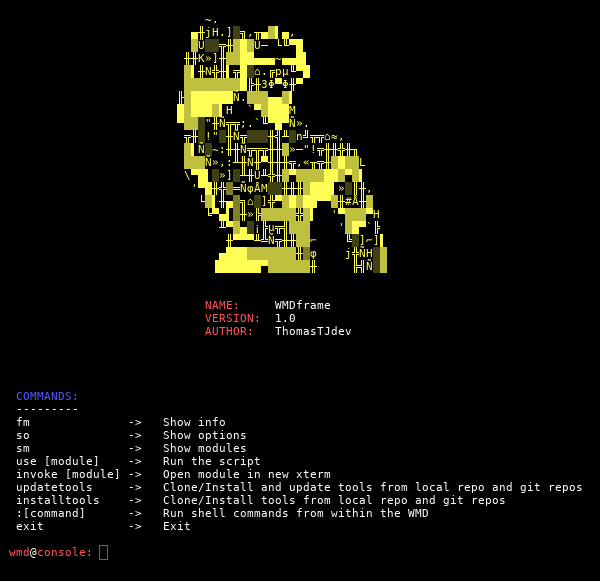

# WMD
## Weapon of Mass Destruction

This is a python tool with a collection of IT security software. The software is incapsulated in "modules". The modules does consist of pure python code and/or external third programs.

## Main functions

To use a module, run the command "use [module_call]", e.g. "use apsniff", to activate the module.  
The modules options can be changed with "set [parameter] [value]".  
Inside the modules, you always have the possibilty to view the options with the command "so".  
Your environment settings is in core/config.ini. Please adjust them before running.

**Screenshot:**

## Web menu

Run the command "www" from the console to activate a Flask server showing the modules in your browser. Access it from: 127.0.0.1:5000.

**Screenshot:**

## Modules

CATEGORY      | NAME                           | TYPE       | CALL           | DESCRIPTION
------------- | ------------------------------ | ---------- | -------------- | --------------------------------------------------
bruteforce    |  Admin Finder                  | loginpath  |  adminfinder   |  A Simple script to find admin-paths for webpages. (Arthur: Spaddex)
bruteforce    |  BF RAR                        | rar        |  bfrar         |  Bruteforce a RAR file
bruteforce    |  Bruteforce SSH                | ssh        |  bfssh         |  Bruteforce SSH login
bruteforce    |  Bruteforce weblogin form      | web        |  bfweb         |  Bruteforce a weblogin form with word- and passlist
bruteforce    |  BF ZIP                        | zip        |  bfzip         |  Bruteforce a ZIP file
cracking      |  John the Ripper               | aut        |  john          |  As you know - kill the hash
cracking      |  Identify hash                 | hash       |  hashid        |  Identify a hash
cracking      |  Crack WPA 4-way handshake     | wpa        |  crackwpa      |  Gather WPA 4-way handshake from accesspoint and crack it
exploit       |  Exploitdb                     | search     |  exploitdb     |  Shell-style script to search exploit-db.com exploits. (Arthur: mattoufoutu)
mail          |  Spoofcheck email domain       | sin        |  mspoofcheck   |  Check if a domain can be spoofed for e.g. emailing
monitor       |  ARP monitor alert             | arp        |  arpmon        |  Monitor ARP table and alert for changes
monitor       |  IP monitor alert              | ip         |  ipmon         |  Monitor IP's and alert for changes
other         |  Change settings               | settings   |  settings      |  Change your environment settings, e.g. interface
recon         |  Domain info groper            | dns        |  dig           |  Using dig command you can query DNS name servers for your DNS lookup related tasks
recon         |  dnsmap                        | dns        |  dnsmap        |  DNS Network Mapper. Enumeration and bruteforcing.
recon         |  dnsrecon                      | dns        |  dnsrecon      |  Multiple DNS recon abilities.
router        |  Routersploit                  | framework  |  rsploit       |  Framework for routers wiht exploits and getting creds. (Arthur: Reverse Shell Security)
scan          |  Lan scan                      | sin        |  lanscan       |  Scan local net - recon
sniff         |  AP sniff                      | aut        |  apsniff       |  Create AP and sniff HTTPS and avoid HSTS + Beef
sniff         |  Bettercap                     | sin        |  bettercap     |  Bettercap integration for sniffing packets and bypass HSTS and HTTPS
socialeng     |  Instagram bot                 | instagram  |  instabot      |  Instagram bot for performing various activities (Arthur: LevPasha)
spoof         |  ARP spoof                     | arp        |  arpspoof      |  Spoofing ARP
sql           |  Gdork SQLi                    | sin        |  gdsqli        |  Scrape net for urls and check if they are prone to SQL injection
system        |  Macchanger                    | mac        |  macc          |  Change your MAC address
tools         |  Search hacktools              | search     |  searchht      |  Searchengine for hackingtools
wifi          |  Create an Accesspoint         | accesspoint|  createap      |  Create an Accesspoint
wifi          |  WiFi utils                    | wifi       |  wifiutils     |  Utilities for WiFi, e.g. deauth, WiFi's, clients, probes, etc.

## Run

**Before your first run, please adjust your environmentsettings in core/config.ini**

Start the console with:
`python3 wmd.py`

Start a single module:
`python3 wmd.py -m [CALL]`

Start webserver:
`python3 wmd.py -w`

## Requirements

_**Before you run it, please adjust your environmentsettings in core/config.ini**_

**Requirements:**  
* Python3
* Python libraries requirements in **requirements.txt**

**Optional tools/software/GIT:**   
_modules which needs them will inform you about it and crash_
* GIT: Admin-Finder
* Aircrack-ng
* Airomon-ng
* Airodump-ng
* Airolib-ng
* Arp
* Arpspoof
* Beef
* Bettercap
* Create_ap
* Dig
* Dnsmap
* GIT: Dnsrecon
* GIT: Exploitdb
* GIT: Hashid
* GIT: Instabot
* John the Ripper
* Nmap
* GIT: Routersploit
* GIT: Spoofcheck
* GIT: XSSER

## Development
### Structure

* core --> The core files with functions used all over the code
* files --> Static files, passwordlist, etc.
* logs --> Standard folder for saving logs into
* modules --> Containing the modules
* tmp --> Guess
* tools --> GIT tools
* www --> Files for the webserver

#### New module

Checkout the template in `modules/module_template.py`

#### Add module

Run `python3 wmd.py -a modulePathName.py`

#### Pull requests

* Only python3 code
* Code needs to follow pep8 flake8 (no need for linebreak)

### Todo  
#### Various  
* Proxychain
* Tor
* Threading on all BF
* Try/except on imports on modules for running with os.system
* Add run command with : in modules
* Create extractor for github markdown
* Add info about 'set para value' in modules (missing?!)
* Regenerate modules.xml (loop through modules)
* Design modules with core import and parser for design
* Change checkInstalled to checkInstalledFull for compability
* Check that there are enough credit to arthurs of tools, repos, etc.
* Split updatetools into local tools vs git
* When adding modules strip <> to ensuring XML format
* Change behavior of install and update tools

#### core/tools.py
* Do a run through config.ini and extract names for the updatecommand instead of DRY in two functions

#### Internal code
* cleanup getLocalIP (local_ip) in functions
* Comment before and after imports for visual improvement
* When using sym/gitrun to run external program, change variable from lower to CAPITAL

#### Modules
* sqlmap
* http sniff pwd
* monitor network auto
* xsser
* target attack website or ip
* system information
* dns fake
* grep, sed, awk
